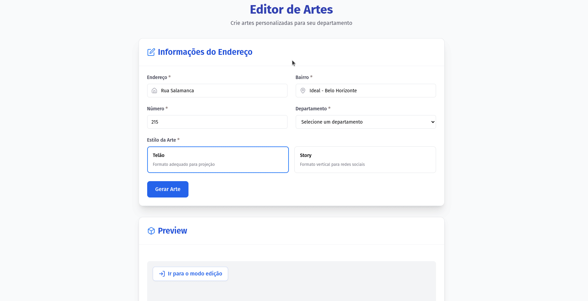

# 🎨 Art Generator



This project is an image generator created for my church. It allows users to create customized artwork in **1920x1080** and **1080x1920** resolutions, making it easy to produce promotional materials.

Users can add custom text to the artwork and freely position it within the layout using the **Canvas API** for graphic manipulation.

## ✨ Features

- **Image generation** in **1920x1080** (landscape) and **1080x1920** (portrait) formats.
- **Text editing**: Users can insert and modify custom text.
- **Text movement** within the artwork, allowing precise positioning.
- **Export final artwork** as a ready-to-use image.

## 🚀 How to Run Locally

1. Clone this repository:

```bash
git clone git@github.com:Santosl2/imersao-gerador-de-artes.git
```

2. Open the project folder and launch the `index.html` file in your browser.

## 🛠️ Technologies Used

- **HTML5**
- **JavaScript** (DOM manipulation and generator logic)
- **Canvas API** (image editing and rendering)

## 📜 License

This project is free to use for non-commercial purposes. If you would like to contribute or use it in a different way, please contact me.
